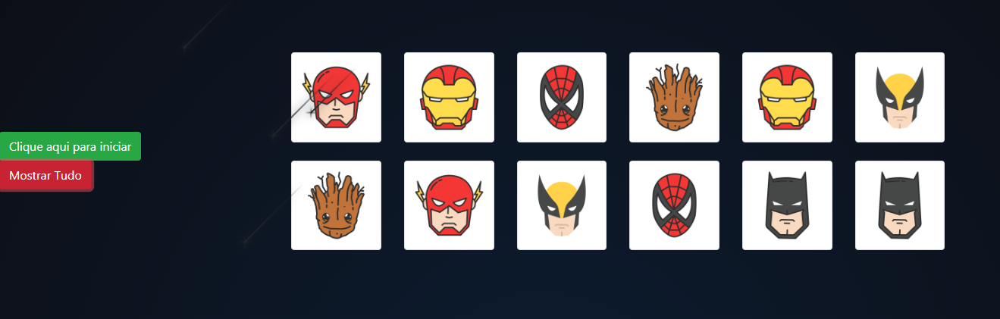
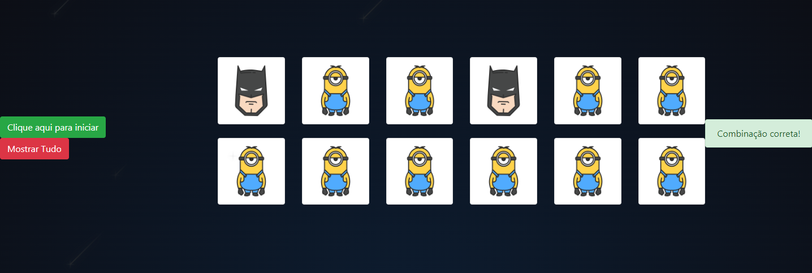
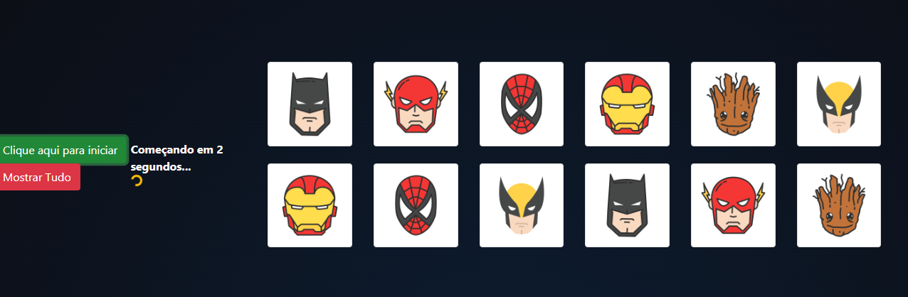

# Leia em:  -- Português --

<h1 align="center">
    
</h1>

 <a href="#-sobre-o-projeto">Sobre</a> •
 <a href="#-funcionalidades">Funcionalidades</a> •
 <a href="#-tecnologias">Tecnologias</a> •
 <a href="#-autor">Autor</a> •

## 💻 Sobre o projeto

💻 Jogo da Memória - O tão famoso jogo de nossa infância jogo da memória, muito fácil de jogar e muito divertido. Caso tenha dúvidas veja em <a href="#-funcionalidades">Funcionalidades</a> como funciona!

---

## ⚙️ Funcionalidades

- [x] Iniciando o jogo, motrando todas as cartas:
    <h1 align="center">
        
    </h1>

- [x] Cartas viradas e fazendo um par, mostra mensagem de sucesso ou erro:
    <h1 align="center">
        
    </h1>

- [x] Cartas embaralhadas, memorize as cartas e começando em 3,2,1! Bom jogo!:
    <h1 align="center">
        
    </h1>

---

## 🛠 Tecnologias

A seguinte ferramenta foi usada na construção do projeto:

- **[HTML](https://developer.mozilla.org/pt-BR/docs/Web/HTML)**
- **[CSS](https://developer.mozilla.org/pt-BR/docs/Web/CSS)**
- **[SASS](https://sass-lang.com/)**
- **[JavaScript](https://www.javascript.com/)**

## 🦸 Autor

 
  
 <b>Henrique M. Kronhardt</b></a>
  

---

Feito com ❤️ por Henrique M. Kronhardt 👋🏽 [Entre em contato!](https://www.linkedin.com/in/henriquekronhardt/)

# Read in:  -- English --

 <a href="#-about-the-project">About</a> •
 <a href="#-features">Features</a> •
 <a href="#-technologies">Technologies</a> •
 <a href="#-author">Author</a> •

## 💻 About the project

💻 Memory Game - The soo Memory Game - The so famous game of our childhood memory game, very easy to play and very fun. If you have any doubts, check out <a href="#-features">Features</a> how it works!

---

## ⚙️ Features

- [x] Starting the game, showing all cards:
    <h1 align="center">
        
    </h1>

- [x] Upturned cards and making a pair, show success or error message:
    <h1 align="center">
        
    </h1>

- [x] Shuffled cards, memorize the cards and starting at 3,2,1! Good game!:
    <h1 align="center">
        
    </h1>

---

## 🛠 Technologies

The following tool was used in building the project:

- **[HTML](https://developer.mozilla.org/pt-BR/docs/Web/HTML)**
- **[CSS](https://developer.mozilla.org/pt-BR/docs/Web/CSS)**
- **[SASS](https://sass-lang.com/)**
- **[JavaScript](https://www.javascript.com/)**

## Author

 
  
 <b>Henrique M. Kronhardt</b></a>
  

---

Made with ❤️ by Henrique M. Kronhardt 👋🏽 [Get in touch!](https://www.linkedin.com/in/henriquekronhardt/)
