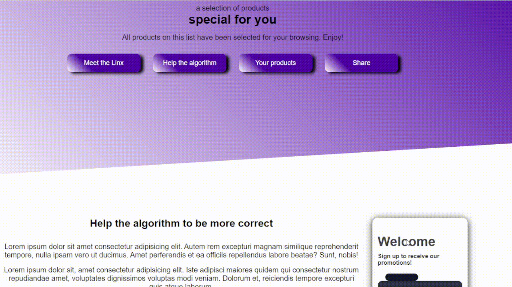
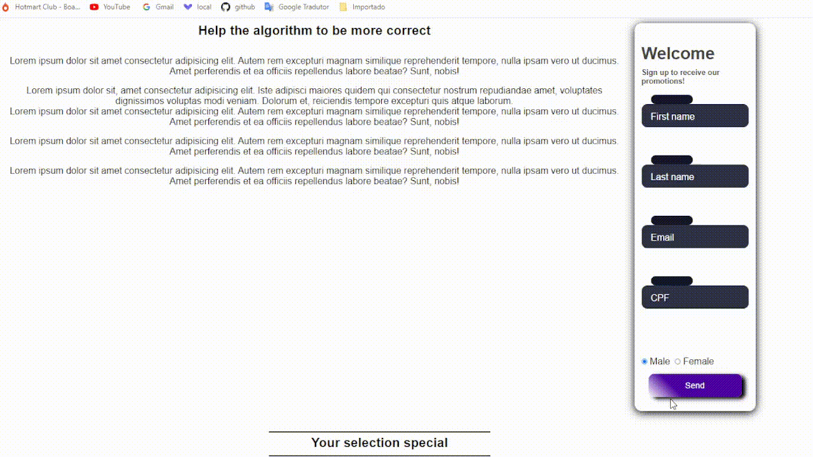

# Leia em:  -- <a href="#portugues">Português </a> / PT -- • -- Read in: -- <a href="#english">English</a> / EN --

<h1 align="center">
    
</h1>

 <a href="#-sobre-o-projeto">Sobre</a> •
 <a href="#-funcionalidades">Funcionalidades</a> •
 <a href="#-tecnologias">Tecnologias</a> •
 <a href="#-autor">Autor</a> •

## 💻 Sobre o projeto

💻 Landing Page - Veja essa landing page. Espero que goste!! :pushpin: :wink:

---

## ⚙️ Funcionalidades

- [x] Início:
    <h1 align="center">
        
    </h1>

- [x] Produtos vindo da API:
    <h1 align="center">
        
    </h1>

- [x] Usuário se registrando para receber promoções:
    <h1 align="center">
        
    </h1>

- [x] Enviando dados de um amigo:
    <h1 align="center">
        
    </h1>

---

## 🛠 Tecnologias

A seguinte ferramenta foi usada na construção do projeto:

- **[HTML](https://developer.mozilla.org/pt-BR/docs/Web/HTML)**
- **[CSS](https://developer.mozilla.org/pt-BR/docs/Web/CSS)**
- **[JavaScript](https://www.javascript.com/)**

## 🦸 Autor

 
  
 <b>Henrique M. Kronhardt</b></a>
  

---

Feito com ❤️ por Henrique M. Kronhardt 👋🏽 [Entre em contato!](https://www.linkedin.com/in/henriquekronhardt/)

# Read in: -- <a href="#english">English</a> / EN -- • -- Leia em:  -- <a href="#portugues">Português </a> / PT --

 <a href="#-about-the-project">About</a> •
 <a href="#-features">Features</a> •
 <a href="#-technologies">Technologies</a> •
 <a href="#-author">Author</a> •

## 💻 About the project

💻 Landing Page - Check out this landing page, hope you like it!! :pushpin: :wink:

---

## ⚙️ Features

- [x] Home:
    <h1 align="center">
        
    </h1>

- [x] Products from API:
    <h1 align="center">
        
    </h1>

- [x] User register for receive promotions:
    <h1 align="center">
       
    </h1>

- [x] The user send data for friend:
    <h1 align="center">
        
    </h1>

---

## 🛠 Technologies

The following tool was used in building the project:

- **[HTML](https://developer.mozilla.org/pt-BR/docs/Web/HTML)**
- **[CSS](https://developer.mozilla.org/pt-BR/docs/Web/CSS)**
- **[JavaScript](https://www.javascript.com/)**

## Author

 
  
 <b>Henrique M. Kronhardt</b></a>
  

---

Made with ❤️ by Henrique M. Kronhardt 👋🏽 [Get in touch!](https://www.linkedin.com/in/henriquekronhardt/)
